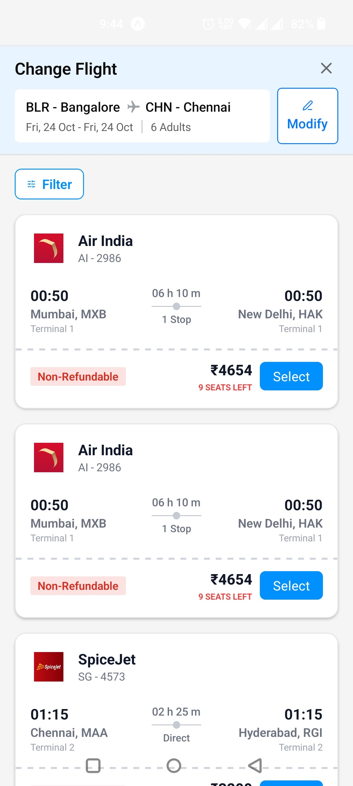

Assignment Submission by Anush Dubey
Email: anushdubey881@gmail.com

# TF App Flight (UI Demo)

## Quick Start
1) Install dependencies
```
npm install
```
2) Run the dev app
```
npx expo start
```

This launches Metro (the React Native bundler). From the Metro UI:
- Press "a" to run on Android emulator/device
- Or scan the QR with Expo Go on your phone
- Metro watches files and live-reloads changes

## Build APK (for testing UI)
Cloud (recommended):
```
npm i -g eas-cli
eas login
eas build:configure
eas build -p android --profile apk
```
Local:
```
npx expo prebuild
cd android
./gradlew assembleRelease   # Windows: .\gradlew.bat assembleRelease
```

## Project Structure
- `app/`: Expo Router screens (`_layout.tsx`, `index.tsx`, `+not-found.tsx`)
- `components/`: `FlightHeader`, `FlightCard`
- `assets/images/`: App icons and airline logos
- `theme.ts`: Centralized colors/spacing
- `types.ts`: Shared TypeScript interfaces

## Notes
- Android package set in `app.json` → `com.demo.tfappflight`
- EAS profile for APK in `eas.json`

## Walkthrough
- Header with route and Modify button
- Cards per flight: airline logo, timings, duration timeline, refund tag, price and Select CTA
- Uniform design for Air India and SpiceJet via a common logo frame

## Screenshots / Demo


Demo video (download to view):
`./assets/media/demo.mp4`
